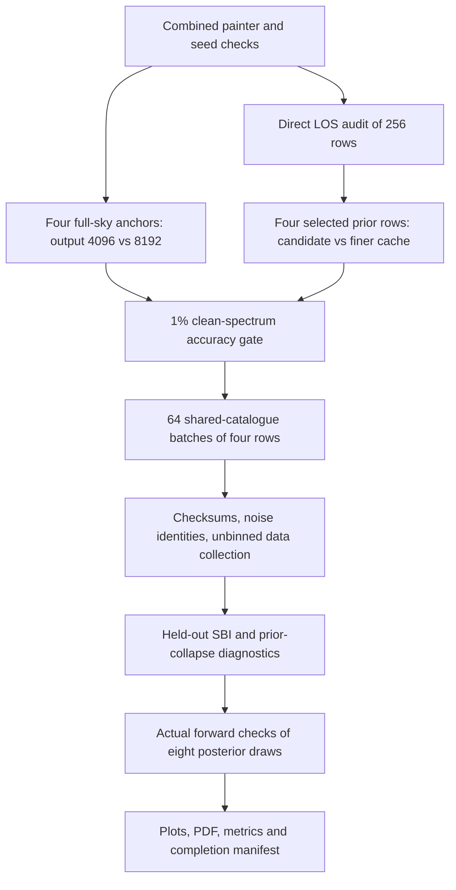

# Accelerated 256-row HalfDome diagnostic

This is the September 22 diagnostic authorized by the user, including final
numerical checks, submission of the saved 256 rows, and analysis. A successful
small software test is not a completed dataset or a certificate for a larger
science run. Current results and scheduler receipts live beside the code.

## Scientific definition

- Preserve the prepared `theta_design.npy`, `noise_seeds.npy` and held-out split.
- Independent uniforms in **physical** parameter values, with no rejection:

| Parameter | Lower | Upper |
|---|---:|---:|
| P0 | 1 | 60 |
| xc | 0.025 | 4 |
| beta | 2.8 | 16 |
| alpha_m_P0 | -0.6 | 1.5 |
| alpha_m_xc | -1 | 0.4 |
| alpha_m_beta | -0.2 | 0.4 |
| alpha_z_P0 | -6 | 0.5 |
| alpha_z_xc | -1.5 | 3 |
| alpha_z_beta | -0.5 | 2 |

- Use the selected 85,224,251 catalogue halos, M200c/h conversion, fixed painter
  cosmology h=0.68, Omega_b=0.049, Omega_c=0.261, and 4 R200c gas sphere.
- Paint NSIDE8192. The beam transform extends to ell=12287; the science data
  retain **all individual ell=80...7979**. A 4096 output is adopted only after
  comparing it with 8192 output from the same raw sky.
- Apply the 2 arcmin Gaussian beam once to the signal. Apply the shared f_sky=0.4
  cap with 60 arcmin apodization and seed 12345.
- Use two independent SO noise realizations per row, with the exact prepared
  seeds. Retain signed cross spectra. Each split uses the supplied N_ell, with
  no signal-beam factor applied again to noise. This is the inherited noise
  convention; two half-depth observational splits would require separate
  exposure/noise normalization if the table represents full-depth data.
- Keep three saved FLAMINGO observations in their original cosmologies. A fitted
  HalfDome posterior is an effective parameter inference, not FLAMINGO truth.

## What was changed in code

The physical projector is copied from the completed validation experiment.
`spherical_truncation_profiles.jl` integrates only the chord inside the gas
sphere. For x>0 its LOS substitution is l=x*sinh(u), with Jacobian
r=x*cosh(u). The integrand is divided by its analytically located peak before
quadrature, then multiplied back by that peak. This is a numerical scaling,
not a changed pressure normalization. The tSZ amplitude comes directly from
XGPaint's prepared pressure slice, avoiding the old ratio of long LOS integrals.
The relative quadrature tolerance stays 1e-10 with a bounded evaluation budget.

The cache stores the positive chord mean H=A*integral_0^1 p(sqrt(x^2+
(X^2-x^2)u^2))du. Painting multiplies it by the exact chord length
2*sqrt(X^2-x^2), and sets the signal to zero outside X=4. The smooth extension
of **H** beyond X removes an interpolation derivative kink. It adds no gas
outside the sphere. The interior integral and physical support are preserved.

`benchmark.jl` supplies chunked catalogue access and shared halo geometry.
Four different pressure fields reuse each direction, R200c angular radius,
intersected ring/pixel list and interpolation coordinate. Their pressures,
maps and noise draws remain independent. `balanced_painter.jl` assigns blocks
of 256 halos greedily to available Julia threads, with the original ring locks.
This changes work allocation, not the pressure arithmetic.

`engine.jl` combines these validated components and the observation operators.
It starts with a 256 x 128 x 64 cache, versus the previous 512 x 256 x 128 grid.
Axes remain log(theta), log(z), log10(M), with unchanged coordinate ranges,
cubic interpolation, padding and 1e-300 numerical floor. Every saved parameter
row is checked at 2,496 direct spherical-column points. If necessary, the code
increases all three cache dimensions to the original or twice-original density.
No failed parameter draw is discarded or replaced.

The probe checks relative error where the column exceeds 1e-5 of the same
halo's central value, absolute error scaled by that central value, and an
area-weighted absolute error integral including faint outskirts. The 0.4%
column budget is a declared numerical target, not a physical prior boundary.
The probe spans the full cache mass/redshift domain conservatively, including
some rarely occupied mass/redshift combinations. Full-sky checks remain
necessary: profile probes alone do not bound every harmonic spectrum error.

`launch.py` verifies frozen source/runtime hashes, writes exact requests, claims
work using atomic Lustre directory creation, and records exits and timing.
`manage.py` verifies row identities and output checksums. Six workers prefer
different batches, then claim remaining unstarted batches. Thus a queued
worker cannot strand part of the design. Four jobs use mini and two use mini2;
each requests 26 CPUs and 64 GB. Only this campaign's unused queued workers
can be cancelled after all rows exist. Other cluster jobs are untouched.

## Gates and sequence

The observable accuracy gate compares every retained clean multipole, rather
than a fractional error in a noisy cross spectrum that may cross zero. It
requires <1% per-ell error in the tested accelerated/finer-cache comparisons
and tests the output-resolution step independently. It also records local
unbinned MOPED discrepancies using held-out conditional-noise covariances. A
0.1-noise-unit budget is an engineering criterion; the user-permitted
bright/shallow exception is reported, while the fractional target still applies.

This gate does **not** include the residual of raw NSIDE8192 point sampling
relative to 16384. Existing results give B12 0.091% spectrum-norm, 1.06% maximum
per-ell and approximately 0.39 conditional-noise-unit differences. The bright
extreme has a much smaller fractional norm but approximately 2.33 noise units.
The finite 16384 comparison is also not the exact continuum. These remain
explicit limitations of the diagnostic and must not be hidden behind a cache
accuracy statement. Unvalidated child-centre averaging and pre-beam shortcuts
are not used for dataset production.

## Inference and interpretation

`diagnostic_analysis.py` separates 192 training-pool rows from 64 held-out rows.
For each training size 64, 128 and 192, preprocessing sees only the 85%
optimization subset. The remaining pool rows serve neural validation, with
fixed split indices checked against SBI 0.22.0. Two neural seeds are used.

The primary `moped_fixed` compressor acts directly on all 7,900 raw D_ell values
using independent B12 finite-difference weights. A training-only signed asinh
transform follows the nine-dimensional projection. The independent comparison
`moped_unbinned` uses local regression derivatives after a per-ell signed asinh
transform. It is approximate MOPED. A 40-bin control is retained solely as an
analysis comparison; it is not the primary MOPED input. OAS covariance solves
use Woodbury matrices rather than allocating a 7900 x 7900 covariance.

Reports include learning curves, prior-only and shuffled-data baselines,
normalized RMSE, 68% and 95% marginal coverage, held-out ranks/samples, actual
validation histories, noise/row identity checks, timings, and B12/FLAMINGO
posteriors. B12 resolution-sensitivity observations add a previously measured
clean resolution difference to the same stochastic residual. These isolate
network response but are explicitly not exact matched-noise rerenderings.

`forward_checks.py` chooses one reproducible random draw from each of two trained
posteriors for each of four observations, checks its cache directly, and runs
the actual full-catalogue painter. Eight forward checks do not define a credible
band or a calibrated posterior-predictive p-value. They provide direct examples
of whether the learned posterior produces appropriate tSZ signals. These rows
are kept outside the 256-row training/held-out dataset.

Flat priors remove a sampling-density preference; they do not guarantee nine
identifiable parameters. A prior-like posterior can reflect low information,
insufficient training, ineffective compression, or inference failure. The
controls distinguish these mechanisms; none alone certifies a larger run.

## Operation and provenance

The cluster root is `/lustre/work/kristero10/tsz_diagnostic_256_accelerated_20260922`.
`test_submission.json`, `spots_submission.json`, `production_submission.json`,
`analysis_submission.json`, and `forward_submission.json` record actual jobs.
The dispatcher submits production only after all numerical gates pass.

The original metadata-recording error and successful first painter test are
preserved under `revisions/metadata_recording_failure/`. The fix changes a Julia
metrics dictionary to accept a vector of cache-node counts; it does not alter
pressure calculations. No failed data are silently promoted to successful data.

The analysis collector refuses missing, repeated or altered row identities and
refuses silently filtered datasets. It stores both individual multipoles and
the optional 40-bin diagnostic summaries in `diagnostic_256/dataset.npz`.

For another dataset size, prepare an explicit new design and seed table in a
fresh root, extend the numerical audit tasks to cover it, and keep the same
batch/worker machinery. `--batch-size` and `--workers` control scheduling.
This diagnostic does not authorize an 8k or 524k production run.

## Files created in this request

- Physics/runtime copies: `benchmark.jl`, `fullsky_test.jl`,
  `spherical_truncation_profiles.jl`, `smooth_exterior.jl`, `legendre16.csv`,
  `balanced_painter.jl`, `external_dependencies.json`, and `reference/` inputs.
- New execution and gates: `engine.jl`, `launch.py`, `manage.py`,
  `final_gate.py`, `dispatch.py`, task JSON files and PBS scripts.
- Inference/reporting: modified copies of `diagnostic_analysis.py`,
  `unbinned_moped.py`, `test_unbinned_moped.py`, `design_tests.py`, plus
  `test_training.py`, `forward_checks.py`, and `report.py`.
- Frozen saved designs/observations: `diagnostic_256/`.
- Documentation and provenance: this README, manifests, scheduler receipts,
  per-test/batch statuses, numerical metrics and later completed reports.

All changes are isolated in this new directory. No earlier experiment source
or pre-existing tracked user modification is edited by this request.
