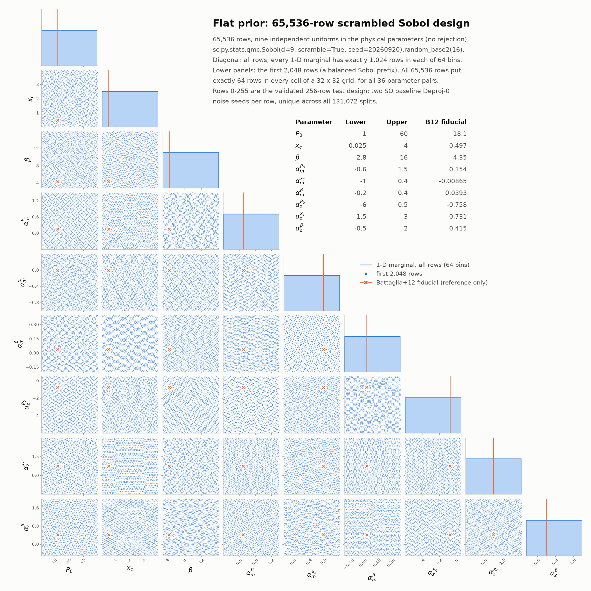

# HalfDome tSZ: 65,536-row flat-prior dataset with SO baseline Deproj-0 noise

This folder is everything needed to generate 65,536 HalfDome Compton-y power
spectra for simulation-based inference: nine Battaglia+12 pressure-profile
parameters drawn from a flat prior (Sobol design), each row observed through a
Simons Observatory LAT mask with its own two SO baseline Deproj-0 noise
realizations.

The physics code is the code of the 256-row test that validated this pipeline
on idark (`/lustre/work/kristero10/tsz_diagnostic_256_accelerated_20260922`,
22-23 September 2026). Every Julia source, noise table and package pin is a
byte-identical copy of what that test ran, checked by SHA-256 before every job.
Only the orchestration around it is new: local paths, SLURM/PBS arrays,
restartable bookkeeping and the checks below.

## What changed since the older Sobol pipeline

If you ran `tSZ_visuals/run_sobol32768_full_maps_slurm.sbatch` before: do not
use it for this dataset. The model and the observation both changed.

| | Older Sobol runs | This dataset |
|---|---|---|
| Gas support | projected: full line of sight, disc cut at the edge | sphere: only gas inside 4 R200c (chord-limited line of sight) |
| Painting | NSIDE 4096 | raw NSIDE 8192, beam, then NSIDE 4096 output |
| Interpolation grid | one fixed grid | audited per row: 256x128x64, refined where the direct check needs it |
| Prior | narrow ranges around Battaglia+12 (`battaglia_sobol_32768.csv`: e.g. beta 3.5-5.2, xc 0.15-0.84) | flat in all nine parameters over much wider bounds (below) |
| Noise | fixed seeds: every row had the same noise maps | two seeds per row, unique across all 131,072 splits |
| Noise tables | baseline and goal, several deprojections | baseline Deproj-0 only (column 2 of the SO table) |
| XGPaint | an older state of the `cluster` branch | tag `validated-tsz256-20260922` of kristero/XGPaint.jl |
| Julia | whatever was installed | exactly 1.12.2 |

## What each row produces

Every row writes, under `run_root/rows/NNNNN/` (C_ell of Compton-y, float64,
length 7980 for ell = 0..7979):

| File | Content |
|---|---|
| `masked_clean_cl.npy` | clean signal, 2 arcmin beam, apodized f_sky = 0.4 cap mask |
| `masked_noisy_cross_cl.npy` | signed cross spectrum of two masked signal+noise maps; each split has its own noise seed and the full SO N_ell (no beam on the noise) |
| `unmasked_clean_cl.npy` | full-sky clean signal |
| `observation.toml` | split seeds, noise-map and mask SHA-256 |
| `status.json` | row, parameters, cache grid, SHA-256 of the files above |

`manage.py collect` turns these into arrays of D_ell = ell(ell+1)C_ell/2pi at
ell = 80..7979 (7,900 values per row), plus the 40-bin versions used by the
256-row test.

## Quick start

Requirements: Linux x86-64, bash, Python >= 3.8 with numpy (plus `tomli` or
`toml` if Python < 3.11), the HalfDome `lightcone_100.hdf5` catalogue, and
internet access for step 1. scipy and matplotlib are needed only to re-check
the design (`design/make_design_64k.py --check`) or redraw the prior plot.

Steps 1-4 take about an hour. Run everything from this folder.

```bash
# 0. Get the folder (a sparse clone; the full repository history is large)
git clone --filter=blob:none --sparse --branch tsz64k-flat-prior-v1 https://github.com/kristero/HalfDome_kSZ.git
cd HalfDome_kSZ && git sparse-checkout set tSZ_64k_flat_prior_SO_baseline_deproj0
cd tSZ_64k_flat_prior_SO_baseline_deproj0

# 1. Julia 1.12.2 + pinned packages (needs internet). On a login node that must not
#    compile, add --no-precompile here and run `jobs/slurm/submit.sh precompile` after step 2.
setup/install_julia_env.sh /path/to/julia_tsz64k

# 2. Configuration: four absolute paths
cp pipeline/config.example.toml pipeline/config.toml
$EDITOR pipeline/config.toml

# 3. Optional but recommended: the catalogue must be the file used by the test
sha256sum /path/to/lightcone_100.hdf5   # de7ad631ca4552d9e723c7b0c146a5267d90a6cf8f4a843273ab4b4a97c0828f

# 4. Reproduce rows 0-3 of the 256-row test (1 job, 26 cores, ~20 min). Must print "passed": true.
jobs/slurm/submit.sh repro --partition=... --account=...
python3 pipeline/manage.py repro-check          # rereads the finished job and prints the comparison

# 5. Cache-accuracy audits: 256 array tasks of 256 rows (6 cores each, typically 45-90 min)
python3 pipeline/manage.py prepare-audits
ARRAY_LIMIT=64 jobs/slurm/submit.sh audit --partition=...

# 6. When all audits are done: batch plan (16,384 batches of 4 rows), then compare rows 0-255 with the test
python3 pipeline/manage.py prepare-batches
python3 pipeline/manage.py compare-test256

# 7. Production: 4,096 array tasks of 4 batches (26 cores, 64 GB, ~80 min each)
ARRAY_LIMIT=200 jobs/slurm/submit.sh production --partition=...
python3 pipeline/manage.py status               # at any time

# 8. Collect and check
jobs/slurm/submit.sh collect
python3 pipeline/manage.py compare-test256      # now also compares the clean spectra of rows 0-255
```

`jobs/slurm/submit.sh` passes any extra options straight to `sbatch`, sizes the
arrays from the plan, splits them to respect `MAX_ARRAY_SIZE` (default 1000),
and writes logs to `run_root/logs/`. `DRY_RUN=1` prints the `sbatch` commands
without submitting. `jobs/pbs/` has the same stages for PBS Pro (idark).

A prefix of the design is a balanced smaller dataset, so the run can be
delivered in stages. For example, rows 0-8191 are batches 0-2047, which are
production array tasks 0-511:

```bash
FIRST_TASK=0 LAST_TASK=511 jobs/slurm/submit.sh production --partition=...
COLLECT_ARGS="--rows 8192" jobs/slurm/submit.sh collect
```

## Resources

Measured in the 256-row test on idark (26-core nodes):

| Stage | Per job | Whole 65,536-row run |
|---|---|---|
| Production batch (4 rows share one catalogue pass) | 18-20 min on 26 threads, peak RSS 38.7 GiB; request 64 GB | 16,384 batches, about 5,100 node-hours (134,000 core-hours) |
| Audit (per row) | median 8 s, max 96 s on 6 threads | about 300 six-core job-hours (1,800 core-hours) |
| Reproduction check | one production batch | 0.4 node-hours |

Disk: about 40 GB in `run_root` (audit probes about 19 GB, per-row spectra and
logs about 13 GB, collected float64 arrays about 8 GB, or 12 GB with
`--include-unmasked`) and about 0.7 million files. Every batch reads the whole
catalogue in 2-million-halo chunks, so keep the catalogue and `run_root` on the
parallel file system, not on `$HOME`.

## The design and the prior

Design files are in `design/`. The saved arrays are authoritative; do not
regenerate them.

| File | Content |
|---|---|
| `battaglia_flat_sobol_65536.csv` | the 65,536 x 9 design, same header as the older Sobol CSVs |
| `theta_design_65536.npy` | the same array, float64 |
| `noise_seeds_65536.npy` | 65,536 x 2 int64 split seeds |
| `design_manifest.json` | bounds, generator, seed rule, checks and SHA-256 |
| `prior_65536.png` | the prior: marginals, 2-D coverage, bounds |

The prior is independent uniforms in the physical parameter values, with no
rejection. The pressure-profile slopes are fixed at alpha = 1 and gamma = -0.3.

| Parameter | Lower | Upper | Battaglia+12 |
|---|---:|---:|---:|
| `P0` | 1 | 60 | 18.1 |
| `xc` | 0.025 | 4 | 0.497 |
| `beta` | 2.8 | 16 | 4.35 |
| `alpha_m_P0` | -0.6 | 1.5 | 0.154 |
| `alpha_m_xc` | -1 | 0.4 | -0.00865 |
| `alpha_m_beta` | -0.2 | 0.4 | 0.0393 |
| `alpha_z_P0` | -6 | 0.5 | -0.758 |
| `alpha_z_xc` | -1.5 | 3 | 0.731 |
| `alpha_z_beta` | -0.5 | 2 | 0.415 |



The design is `scipy.stats.qmc.Sobol(d=9, scramble=True, seed=20260920)`, the
first 2^16 points, mapped linearly to the bounds (`design/design_tests.py`, the
generator of the 256-row test). Every 1-D marginal has exactly 1,024 rows in
each of 64 bins. Every cell of a 32 x 32 grid holds exactly 64 rows, for all
36 parameter pairs.

Because the seed and dimension are fixed, rows 0..N-1 form a balanced subset
for every power of two N. Rows 0-255 are exactly the 256-row test design. Those
rows therefore check your installation (their clean spectra must match the
test). It also means the 256-row test is not an independent held-out set for
a network trained on this dataset.

Noise seeds are `noise_seed(row, split, 'train')` from `design_tests.py`: the
first 8 bytes of SHA-256(`sphere4-flat-v1|20260920|train|<row>|<split>`) as a
big-endian integer with the top bit cleared, for split 1 and 2. All 131,072 seeds are distinct. None of them matches the
'engineering' stream of the 256-row test or any fixed seed of the pipeline.
The engine seeds Julia 1.12.2's `MersenneTwister` with them; another Julia
version gives different noise maps from the same seeds.

## What the engine does

This is a condensed version of `reference/test256/README_test256.md`, which
has the full description and validation history.

- Catalogue: HalfDome `lightcone_100.hdf5`, M200c/h >= 1e12 Msun with h = 0.68,
  exactly 85,224,251 halos; the engine stops for any other count. Painter
  cosmology h = 0.68, Omega_b = 0.049, Omega_c = 0.261.
- Pressure: Battaglia+12 generalized NFW with the nine parameters above,
  integrated only inside a 4 R200c sphere.
- Cache: the chord-mean column is interpolated on a log(theta), log(z),
  log10(M) grid. The audit compares every row's cache with direct integration
  at 2,496 points and refines the grid (256x128x64, 512x256x128, 1024x512x256)
  until the error is below 0.4%. In the test, 84% of rows passed at the
  coarsest grid and 16% at the next one.
- Maps: raw NSIDE 8192 point painting, `map2alm` to lmax 12287, 2 arcmin
  Gaussian beam, NSIDE 4096 output. Four rows share one catalogue pass: halo
  geometry is computed once and each row keeps its own pressure, map and noise.
- Observation: one fixed apodized cap mask (f_sky = 0.4, 60 arcmin
  apodization, seed 12345, SHA-256 `a6c3d64d...`). Spectra use lmax 7979 and
  niter 0.

## Checks built into the pipeline

| Check | Where | Passes when |
|---|---|---|
| Frozen inputs | before every job (`pipeline/common.py`) | every file in `pipeline/source_manifest.json` and the design files has its recorded SHA-256 |
| Julia runtime | `setup/verify_env.jl` | Julia 1.12.2, pinned package versions, all 17 XGPaint source files identical to the test |
| Reproduction | `manage.py repro-check` | rows 0-3 of the test, rerun with the test's seeds and cache grids, agree to 1e-6 (threading alone gives about 1e-14) and the random-number fingerprint is identical; production refuses to start until this has passed |
| Audits | `manage.py prepare-batches` | every row's cache meets the accuracy target; no plan is written otherwise |
| Rows 0-255 | `manage.py compare-test256` | same cache grids and audit metrics as the test; clean spectra agree to 1e-6 |
| Collection | `manage.py collect` | parameters, seeds, checksums, mask and halo count match for every row, and all noise realizations are distinct |

`repro-check` also reports whether the noise maps are bit-identical to the
test. On other CPUs the SIMD path of libsharp can differ in the last bit, so
that item is informational; the spectra must still agree.

## When something fails

Nothing is silently retried, redrawn or dropped.

- A failed batch keeps its `run.log`, `command.json` and `status.json` in
  `run_root/batches/NNNNN/`, and `status` lists it. After fixing the cause:
  `python3 pipeline/manage.py reset --all-failed` moves failed attempts to
  `run_root/attempts/`. Then resubmit: `POOL_WORKERS=8 jobs/slurm/submit.sh pool`
  runs any batch that is not done, or resubmit the affected array tasks.
- A job killed without cleanup (node failure, hard kill) leaves a `claim`
  directory. `status` shows its owner job. Once that job is gone:
  `reset --stale-claims-hours 6`.
- Timeouts: no new batch starts after `STOP_AFTER_HOURS` (default 3, matching
  the default `--time` of 4 h). Keep them consistent if you change
  `BATCHES_PER_TASK`.
- A row whose cache cannot meet the accuracy target even at 1024x512x256 stops
  `prepare-batches`. Do not remove the row. Send `run_root/audit_summary.json`
  to Kristers. `prepare-batches --defer-unresolved` plans all other rows and
  lists the deferred ones in the plan and in the collected `meta.json`.
- Do not edit files in `engine/`, `halfdome_sources/`, `julia_env/` or
  `design/`, and do not `Pkg.update` or `Pkg.resolve` the environment. The
  launcher refuses to run with a changed file. `Pkg.instantiate()` warns that
  "the project dependencies or compat requirements have changed since the
  manifest was last resolved" and suggests `Pkg.resolve()`: the validated
  runtime printed the same warning, so ignore it.
- The HalfDome configuration lets environment variables override its command
  line. The launcher therefore strips every variable the Julia sources read
  (121 names such as `NSIDE`, `BATTAGLIA_P0_AMP`, `BATTAGLIA_SOBOL_ROW`,
  `TSZ_*`, `HALFDOME_PATH`) before starting Julia. Leftovers from the older
  SLURM scripts cannot change a row; `command.json` of each batch lists what was
  removed.

## What to send back

The whole `run_root/dataset/rows_65536/` (or `rows_<N>` for a partial
delivery). It contains `clean_dl_unbinned.npy`, `noisy_dl_unbinned.npy`,
`clean_dl.npy`, `noisy_dl.npy`, `theta.npy`, `noise_seeds.npy`,
`ell_unbinned.npy`, `row_id.npy` and `meta.json`. Also send, small but
essential for provenance: `run_root/run_manifest.json`, `audit_summary.json`,
`compare_test256.json` and `repro/repro_result.json`.

## Folder contents

```
design/            flat-prior Sobol design, seeds, generator, prior plot
engine/            Julia engine of the 256-row test (frozen)
halfdome_sources/  HalfDome tSZ operators, process_maps.jl, SO noise tables (frozen)
julia_env/         Project.toml + Manifest.toml of the test; XGPaint pinned to GitHub
pipeline/          manage.py (all commands), common.py (launcher), config, source manifest
setup/             Julia installer and environment check
jobs/              stage.sh + SLURM (jobs/slurm) and PBS (jobs/pbs) wrappers and submitters
reference/test256/ outputs, audits, manifests and orchestration code of the 256-row test
```

## Provenance

- 256-row test: `reference/test256/` holds its README, report, final gate,
  manifests, the batch-000 outputs and the original `launch.py`/`manage.py`.
  `pipeline/source_manifest.json` maps every frozen file to its path on idark
  and to the SHA-256 recorded by the test's own manifests.
- XGPaint: https://github.com/kristero/XGPaint.jl, tag
  `validated-tsz256-20260922`. Its git tree `3b57cacb5f824269f1cae22e7fd2085788d14eee`
  is byte-identical to the `runtime/XGPaint` snapshot that the test loaded
  (commit `ce1d239`). `julia_env/Manifest.toml` pins that tree; it is the only
  file that differs from the test, and only in XGPaint's source line.
- HalfDome catalogue: `lightcone_100.hdf5`, 15,425,622,199 bytes, SHA-256
  `de7ad631ca4552d9e723c7b0c146a5267d90a6cf8f4a843273ab4b4a97c0828f`
  (idark: `/lustre/work/Globus-lt/halfdome/full_res/halos/`).
- Known limits, from the test: NSIDE 8192 point sampling has a measured
  residual against 16384 (0.09% spectrum norm, 1.1% maximum per ell for B12);
  the fixed mask and single catalogue give conditional-noise spectra, not a
  full observational covariance.
